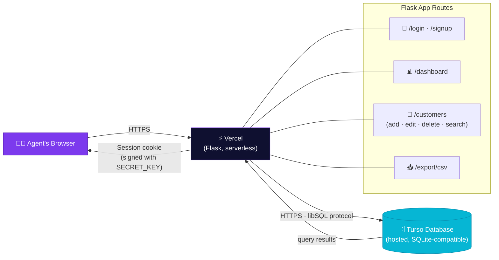
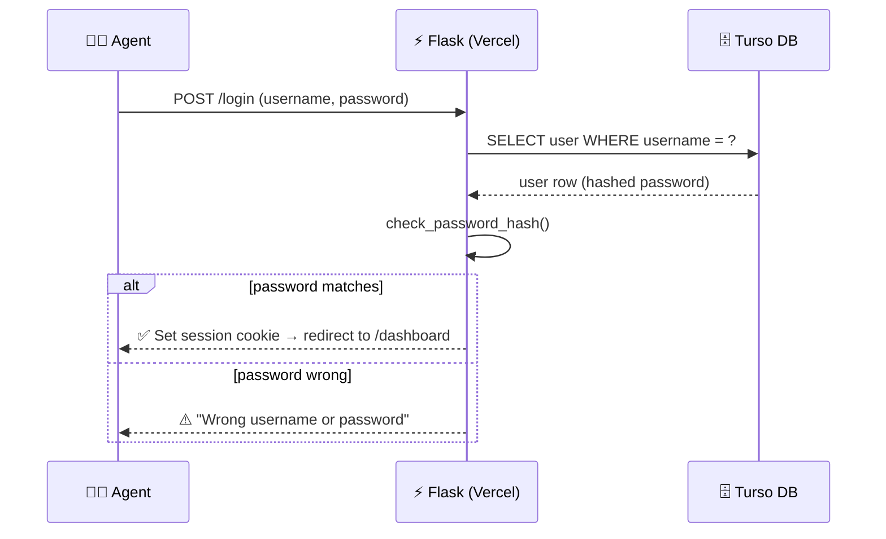

<div align="center">


[](https://git.io/typing-svg)

### A clean, modern workspace for managing policyholders — built for agents who'd rather spend time with clients than with paperwork.


</div>

---

## ✨ What this is

**Policy Register** is a lightweight, private web app for storing policyholder
details, tracking every policy at a glance, and understanding your book of
business through simple visual dashboards. No spreadsheets, no paperwork
pile-up — just a clean ledger that lives in your browser.

Built with **Python (Flask)** on the backend and a hosted **Turso** database,
so your data is safe, backed up, and accessible from anywhere — not stuck on
a single laptop.

---

## 🚀 Features

| | |
|---|---|
| 🔐 | **Secure accounts** — sign in or create your own agent account; passwords are hashed, never stored in plain text |
| 👁️ | **Show/hide password toggle** — no more guessing if Caps Lock ruined your login |
| 🧾 | **Full policyholder records** — name, DOB, gender, phone, email, address, nominee details, policy name & number, policy type, sum assured, premium amount & frequency, start/maturity dates, status, and notes |
| ✏️ | **Add, edit, and delete** policyholders in a few clicks |
| 📊 | **Visual dashboard** — a pie chart of policies by type, a bar chart of new policies by month, and quick stats: total policyholders, active policies, total premium, total sum assured |
| 🔍 | **Instant search** — find any policyholder by name, policy name, or policy number |
| 📥 | **One-click CSV export** — download your entire ledger as a spreadsheet, any time |
| ⚙️ | **Change your password** anytime from Settings |
| 📱 | **Fully responsive** — works comfortably on desktop, tablet, and phone |
| 🎨 | **Polished, animated interface** — because the tool you use every day should feel good to use |

---

## 🏗️ System Design

**High-level architecture** — how a request travels from your browser all the way to your data and back:



**Request lifecycle** — what happens on a typical sign-in:



Everything runs **serverless** on Vercel — no server to patch, restart, or babysit. Every request spins up fresh, talks to Turso over plain HTTPS (no lingering connections to manage), and shuts down. Your data always lives safely outside the app itself, in Turso.

---

- **Backend:** Python 3 + Flask
- **Database:** [Turso](https://turso.tech) (hosted, SQLite-compatible — no server to manage, no local file to lose)
- **Hosting:** [Vercel](https://vercel.com) (serverless, deploys automatically on every push)
- **Frontend:** Hand-crafted HTML templates + a custom animated CSS theme (no frontend framework, no bloat)

---

## 🛠️ Setup

### 1. Get a free Turso database
Sign up at [turso.tech](https://turso.tech), create a database, and grab:
- Your **Database URL** (`libsql://your-db-name.turso.io`)
- An **Auth Token** (Read & Write, no expiry)

### 2. Set your environment variables
```bash
export TURSO_DATABASE_URL="libsql://your-db-name.turso.io"
export TURSO_AUTH_TOKEN="your-token-here"
export SECRET_KEY="any-long-random-string"
```

### 3. Install & run
```bash
pip install -r requirements.txt
python app.py
```

Open your browser to **http://127.0.0.1:5000** 🎉

### First login
```
Username: admin
Password: changeme123
```
⚠️ **Change this password immediately** from **Settings** (bottom-left menu, next to your username) — or simply create your own account from the **Sign up** page instead.

---

## 💾 Where is my data stored?

All data lives in your **Turso** database — hosted, backed up, and available
from anywhere the app is deployed. You're never dependent on a single
computer's hard drive.

Want a local copy any time? Click **Export CSV** in the sidebar for a full
spreadsheet snapshot of every record, whenever you like.

---

## ☁️ Deployment

This app is built to run great on **Vercel**:
1. Push this repo to GitHub
2. Import it into Vercel
3. Add your three environment variables (`TURSO_DATABASE_URL`, `TURSO_AUTH_TOKEN`, `SECRET_KEY`) under **Settings → Environment Variables**
4. Deploy — Vercel redeploys automatically on every push to `main`

A few good habits once you're live:
- ✅ Use a long, random `SECRET_KEY`
- ✅ HTTPS is on by default with Vercel
- ✅ Consider adding rate-limiting to the login page if this becomes multi-user

---

## 📁 Project structure

```
lic_manager/
├── app.py                # Flask app — routes & database logic
├── requirements.txt      # Python dependencies
├── templates/            # HTML pages (login, signup, dashboard, customers...)
└── static/
    └── style.css          # The animated, gradient-driven design system
```

---

<div align="center">

[](https://git.io/typing-svg)

### 🖋️ Designed, built, and lovingly maintained by **Biswajit Pattanaik**

<sub>If this saved you a headache or two, a ⭐ on the repo would make my day.</sub>


</div>
